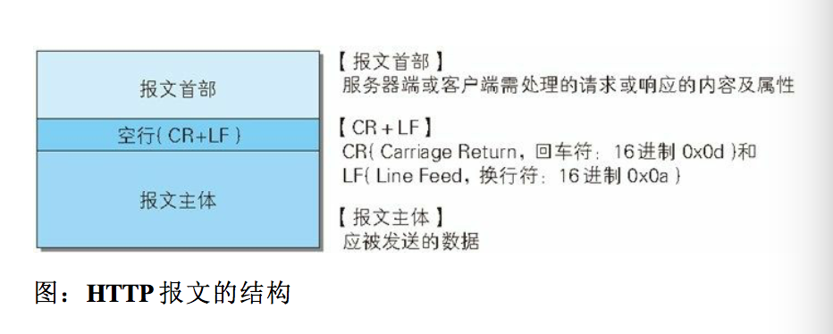
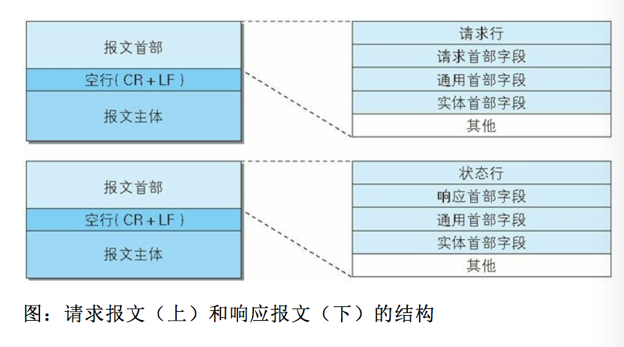
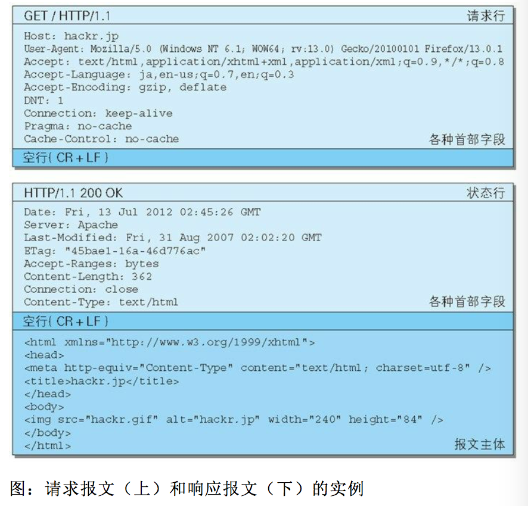

## 三、HTTP报文内的HTTP信息
HTTP通信过程包括从客户端发往服务器的请求及服务器端返回客户端的响应。

#### HTTP报文
用于HTTP协议交互的信息被称为HTTP报文。请求端（客户端）的HTTP报文叫做请求报文，响应端（服务器端）的叫做响应报文。HTTP报文本身是由多行数据构成的字符串文本。

HTTP报文大致可分为报文首部和报文主体两块。通常不一定要有报文主体。

#### 请求报文及响应报文的结构

##### 请求报文和响应报文的首部内容由以下数据组成

**请求行**
包含用于请求的方法，请求URI和HTTP版本

**状态行**
包含表明响应结果的状态码，原因短语和HTTP版本

**首部字段**
包含表示请求和响应的各种条件和属性的各类首部

一般有4种首部，分别是：通用首部、请求首部、响应首部和实体首部。

#### 3.编码提升传输速率
HTTP在传输数据时可以按照数据原貌直接传输，但也可以在传输过程中通过编码提升传输速率。通过在传输时编码，能有效地处理大量的访问请求。但是，编码操作需要计算机来完成，因此会消耗更多的CPU灯资源。

##### 报文主体和实体主体的差异
**报文（message）** 是HTTP通信中的基本单位，由8位组字节流组成，通过HTTP通信传输

**实体（entity）** 作为请求或响应的有效载荷数据（补充项）被传输，其内容由实体首部和实体主体组成。

HTTP报文的主体用于传输请求或响应的实体主体。

通常，报文主体等于实体主体。只有当传输中进行编码操作时，实体主体的内容发生变化，才导致它和报文主体产生差异。

##### 压缩传输的内容编码
为了使邮件内容变小，会先用ZIP压缩文件之后在发送。

HTTP协议中有一种被称为内容编码的功能也能进行类似的操作。

常用内容编码有以下几种
- gzip
- compress
- deflate
- identity

##### 分割发送的分块传输编码
在HTTP通信过程中，请求的编码实体资源尚未全部传输完成之前，浏览器无法显示请求页面。在请求大量数据时，通过把数据分割成多块，能够让浏览器逐步显示页面。

把实体主体分块的功能成为分块传输编码。

分块传输编码会将实体主体分成多个部分。

使用分块传输编码的实体主体会接收的客户端负责解码，恢复到编码前的实体主体。

HTTP/1.1中存在一种称为传输编码的机制。

##### 发送多种数据的多部分对象集合
多部分对象集合包含的对象如下
- multipart/form-data 在web表单文件上传时使用
- multipart/byteranges 状态码206响应报文包含了多个范围的内容时使用

在HTTP报文中使用多部分对象集合时，需要在首部字段里加上Content-type

##### 获取部分内容的范围请求
为解决下载资源过程中网络中断的情况要重头开始，需要一种可恢复的机制。所谓恢复是指能从之前下载中断处恢复下载。

要实现该功能需要制定下载的实体范围。像这样，制定范围发送的请求叫做范围请求

对一份10000字节大小的资源，如果使用范围请求，可以只请求5001~1 000字节内的资源

执行范围请求时，会用到首部字段Range来制定的byte范围。
byte范围的制定形式如下

- 5001~10 000字节`Range:bytes=5001-10000`
- 从5001字节之后全部的`Range:bytes=5001-`
- 从一开始到3000字节和5000~7000字节的多重范围`Range: bytes=-3000, 5000-7000`

针对范围请求，响应会返回状态码为206 Partial Content的响应报文。

如果服务器端无法响应范围请求，则会返回状态码200OK和完整的实体内容。

#### 内容协商返回最合适的内容

内容协商机制是指客户端和服务器端就响应的资源内容进行交涉，然后提供和客户端最为合适的资源。内容协商会以响应资源的语言、字符集、编码方式等作为判断的基准。

包含在请求报文中的某些首部字段就是判断的基准。
- Accept
- Accept-Charset
- Accept-Encoding
- Accept-Language
- Content-Language

##### 内容协商技术有以下3种类型
- 服务器驱动协商 - 由服务器进行内容协商
- 客户端驱动协商 - 由客户端进行内容协商的方式
- 透明协商 - 是服务器驱动和客户端驱动的结合体，是由服务器端和客户端各自进行内容协商的一种方法

## 四、返回结果的HTTP状态码
HTTP状态码负责标识客户端HTTP请求的返回结果、标记服务器端的处理是否正常、通知出现的错误等工作。

#### 状态码告知从服务器端返回的请求结果
状态码的职责是当客户端向服务端发送请求时，描述返回的请求结果。借助状态码，用户可以知道服务器是正常处理了请求，还是出现了错误。

状态码如200 OK，以3位数和原因短语组成

数字中的第一位指定了响应类别，后两位无分类。响应类别有以下5种。

- 1XX   Informational(信息性状态码)  接收的请求正在处理
- 2XX   Success(成功状态码)          请求正常处理完毕
- 3XX   Redirection（重定向） 需要进行附加操作以完成请求
- 4XX   Client Error（客户端错误状态码）服务器无法处理请求
- 5XX   Server Error(服务器错误状态码) 服务器处理请求错误

#### 2XX成功
2XX的响应结果表明请求被正常处理了
##### 200 OK
表示从客户端发来的请求在服务器被正常处理了

##### 204 No Content
代表服务器接受的请求已成功处理，但在返回的响应报文中不含实体的主体部分。另外，也不允许返回任何实体的主体。

##### 206 Partial Content
表示客户端进行了范围请求，而服务器成功执行了这部分的GET请求。响应报文中包含由Content-Range指定范围的实体内容。

#### 3XX重定向
3XX响应结果表明浏览器需要执行某些特殊的处理以正确处理请求。

##### 301 Moved Permanently
永久性重定向。该状态码表示请求的资源已被分配新的URI，以后应使用资源现状所指的URI。
##### 302 Found
临时性重定向。该状态码表示请求的资源已被分配了新的URL,希望用户（本次）能使用新的URI访问

和301 Moved Permanently状态码类似，但是302状态码代表的资源不是被永久移动，只是临时性质的。

##### 303 See Other
该状态码表示由于请求对应的资源存在着另一个URI，应使用的GET方式定向获取请求的资源。

303状态码和302 Found状态码有着相同的功能，但303状态码明确表示客户端应当采用GET方法获取资源，这点与302状态码有区别。

##### 304 Not Modified
该状态码表现客户端发送附带条件的请求时，服务器允许请求访问资源。

##### 307 Temporary Redirect
临时重定向。

#### 4XX客户端错误
4XX的响应结果表明客户端是发生错误的原因所在。
##### 400 Bad Request
该状态码表示请求报文中存在语法错误。
##### 401 Unauthorized
该状态码表示发送的请求需要通过HTTP认证的认证信息。
##### 403 Forbidden
该状态码表明对请求资源的访问被服务器拒绝了。
##### 404 Not Found
该状态码表明服务器上无法找到请求的资源。

#### 5XX服务器错误
5XX的响应结果表明服务器本身发生错误
##### 500 Internal Server Error
该状态码表明服务器端在执行请求时发生了错误。

##### 503 Service Unavailable
该状态码表明服务器暂时处于超负载或正在进行停机维护，现在无法处理请求。
如果事先得知解除以上状况需要的时间，最好写入RetryAfter首部字段再返回给客户端。

