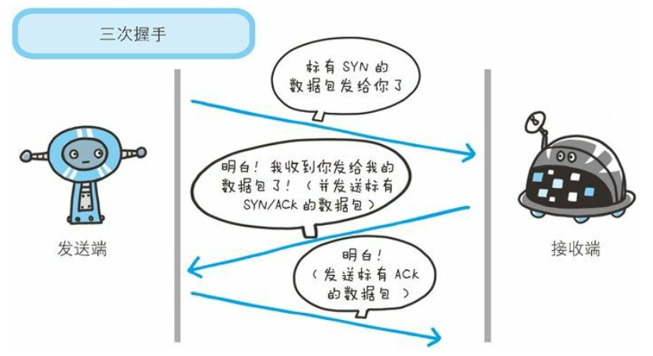
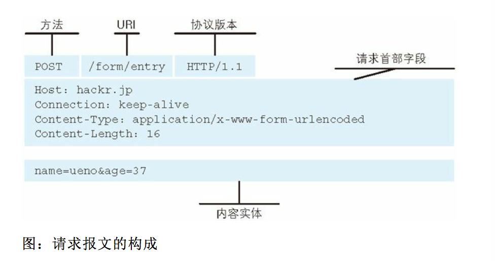
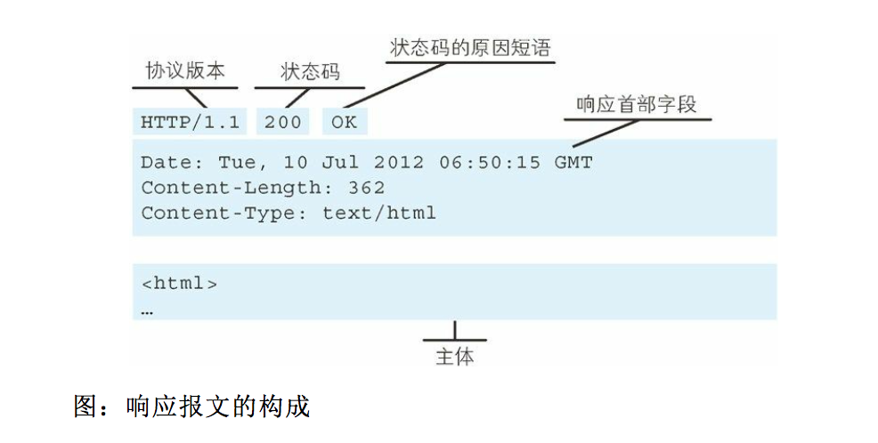

Web使用一种名为HTTP的协议作为规范，完成从客户端到服务器等一系列运作流程。可以说Web是建立在HTTP协议上通信。
> HTTP通常被译为超文本传输协议

#### 网络基础TCP/IP
通常使用网络是在TCP/IP协议族的基础上运作的，而HTTP属于它内部的一个子集

#### TCP/IP分层管理
TCP/IP协议族里重要的一点就是分层。TCP/IP协议族按层次分别为以下4层：应用层、传输层、网络层和数据链路层。

#### TCP/IP协议族各层的作用
**应用层**
应用层决定了向用户提供应用服务时通信的活动

TCP/IP协议族内预存了各类通用的应用服务。比如，FTP和DNS服务就是其中两类。

HTTP协议也处于该层。

**传输层**
传输层对上层应用层，提供处于网络连接中的两台计算机之间的数据传输。

在传输层有两个性质不同的协议：TCP和UDP

**网络层**
网络层用来处理网络上流动的数据包。数据包是网络传输的最小数据单位。该层规定了通过怎样的路径到达对方计算机，并包数据包传送到对方。

**链路层**
用来处理链接网络的硬件部分。

#### TCP/IP通信传输流
利用TCP/IP协议族进行网络通信时，会通过分层顺序与对方进行通信。发送端从应用层往下走，接收端则应用层往上走。

### 与HTTP关系密切的协议：IP TCP和DNS

#### 负责传输的IP协议
按层次分，IP网际协议位于网络层。
IP协议的作用就是把各种数据包传送给对方，而要保证确实传送到对方那里，则需要满足各类条件。其中两个重要的条件是IP地址和MAC地址。

IP地址指明了节点被分配到的地址，MAC地址是指网卡2所属的固定地址。IP地址和MAC地址进行配对。IP地址可变换，但MAC地址基本不会更改。

#### 确保可靠性的TCP协议
按层次分，TCP位于传输层，提供可靠的字节流服务。

所谓的字节流服务是指，为了方便传输，将大块数据分割成报文段为单位的数据包进行管理。

为了准确无误地将数据送达目标处，TCP协议采用了三次握手策略。用TCP协议把数据包送出去后，TCP不会对传送后的情况置之不理，它一定会向对方确认是否成功送达，握手过程中使用TCP的标志(flag)-SYN和ACK。

发送端首先发送一个带SYN标志的数据包给对方。接收端收到后，回传一个带有SYN/ACK标志的数据包以示传达确认信息。最后发送端再回传一个带有ACK标志的数据包，代表“握手结束。”

若在握手过程中某个阶段莫名中断，TCP协议会再次以相同的顺序发送相同的数据包

除了上述三次握手，TCP协议还有其他各种手段来保证通信的可靠性。

#### 负责域名解析的DNS服务
DNS服务是和HTTP协议一样位于应用层的协议。它提供域名到IP地址之间的解析服务。

用户通常使用主机名或域名来访问对方的计算机，而不是直接通过IP地址访问。

DNS协议提供通过域名查找IP地址，或逆向从IP地址反查域名的服务

## 第二章 简单HTTP协议
#### HTTP协议用于客户单和服务器端之间的通信
HTTP协议和TCP/IP协议族内的其他众多的协议相同，用于客户端和服务器之间的通信。
#### 通过请求和响应的交换达成通信
HTTP协议规定，请求从客户端发出，最后服务器端响应该请求并返回。

**举例某个HTTP服务端的请求报文中的部分内容：**
```
GET /index.htm HTTP/1.1
Host: hackr.jp
```
- 起始行开头的GET表示请求访问服务器的类型，称为方法（methods）
- 字符串/index.htm指明了请求访问的资源对象，也叫做请求URI
- HTTP/1.1,即HTTP的版本号，用来提示客户端使用的HTTP协议功能

翻译过来-请求访问某台HTTP服务器上的/index.htm页面资源

请求报文是由请求方法、请求URI、协议版本、可选的请求首部字段和内容实体构成的。


**接收到请求的服务器，会将请求的内容的处理结果以响应的形式返回**
```
HTTP/1.1 200 OK
Date：Tue， 10 Jul 2012 06:50:15 GMT
Content-Length：362
Content-Type：text/html

<html>
......
```
- HTPP/1.1 表示服务器对应的HTTP版本
- 200 OK 表示请求的处理结果的状态（status code）和原因短语（resason-phrase）
- 下一行，首部字段内的一个属性，创建响应的日期时间
- 接着以一空行分隔，之后的内容称为资源实体的主体（entity body）

响应报文基本上由协议版本、状态码、用以解释状态码的原因短语、可选的响应首部字段以及实体主体构成


#### HTTP是不保存状态的协议
HTTP是一种不保存状态，即无状态协议。HTTP协议自身不对请求和响应之间的通信状态进行保存。也就是说在HTTP这个级别，协议对发送过的请求或响应都不做持久化处理。

使用HTTP协议，每当有新的请求发送时，就会有对应的新响应产生。协议本身并不保留之前一切的请求或响应报文的信息。这是为了更快地处理大量事物，确保协议的可伸缩性，而特意把HTTP协议设计成如此简单的。

HTTP/1.1虽然是无状态协议，但为了实现期望的保持状态功能，于是引入了Cookie技术，有了Cookie再用HTTP协议通信，就可以管理状态了。

#### 请求URI定位资源
HTTP协议使用URI定位互联网上的资源。正是因为URI的特定功能，在互联网上任意的资源都能访问到。

#### 告知服务器意图的HTTP方法
- GET：获取资源
- POST：传输实体主体
- PUT：传输文件
- HEAD：获得报文首部
- DELETE：删除文件
- OPTIONS：询问文件的方法
- TRACE：追踪路径
- CONNECT：要求用隧道协议链接代理

#### 持久链接节省通信量
HTTP协议的初始版本中，每进行一次HTTP通信就要断开一次TCP链接。

##### 1.持久链接
为解决上述TCP链接的问题，HTTP/1.1和一部分的HTTP/1.0想出了持久链接（HTTP Persistent Connecttions,也称为HTTP keep-alive或HTTP connection reuse）的方法。持久连接的特点是，只要任意一端没有明确提出断开链接，则保持TCP链接状态。

**持久链接的好处**在于减少了TCP连接的重复建立和断开所造成的额外开销，减轻服务器端的负载。另外，减少开销的那部分时间，使HTTP请求和响应能够更早地结束，这样Web页面的显示速度也就相应提高了。

在HTTP/1.1中，所有的连接默认都是持久链接，但在HTTP/1.0内并未标准化。

##### 2.管线化

持久链接使得多数请求以管线化（pipeling）方式发送称为可能。

这样就能够做到同时并行发送多个请求，而不是一个接一个地等待响应了。

#### 使用Cookie的状态管理
HTTP是无状态协议，它不对之前发生过的请求和响应的状态进行管理。

Cookie技术通过在请求和响应报文中写入Cookie信息来控制客户端的状态。

Cookie会根据从服务器端发送的响应报文内的一个叫做Set-Cookie的首部字段信息，通知客户端保存Cookie。当下次客户端再往该服务器发送请求时，客户端会自动在请求报文中加入Cookie值后发送出去。