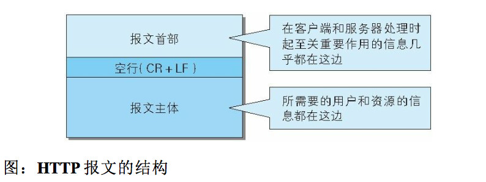
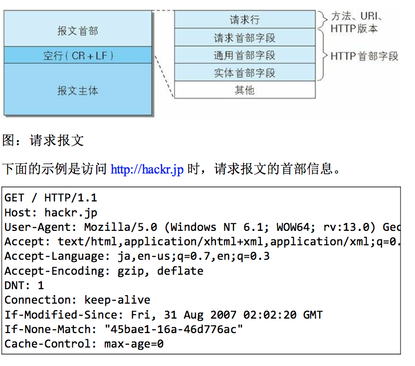
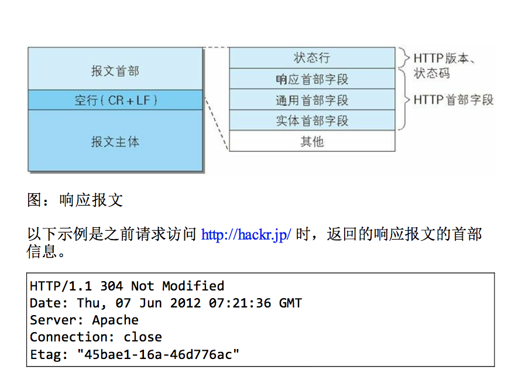
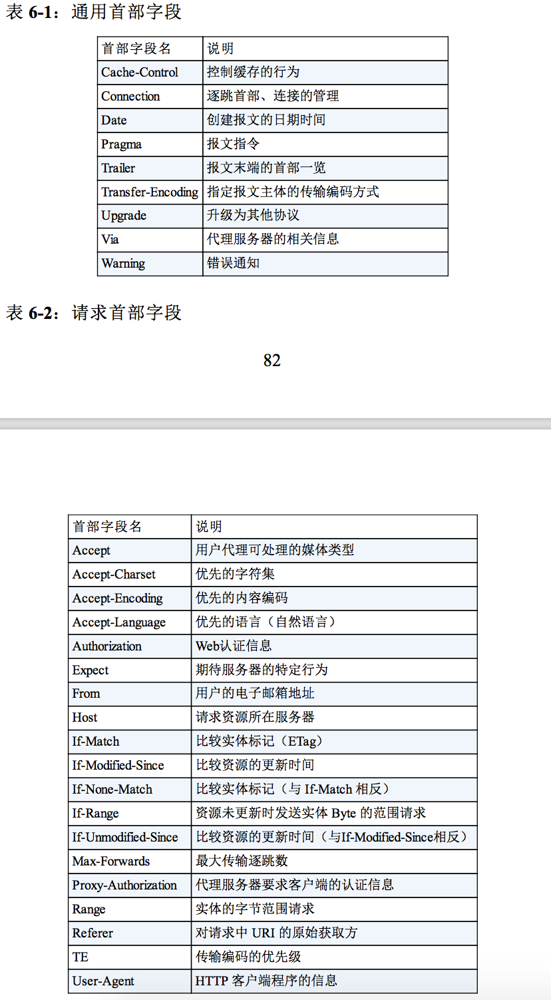
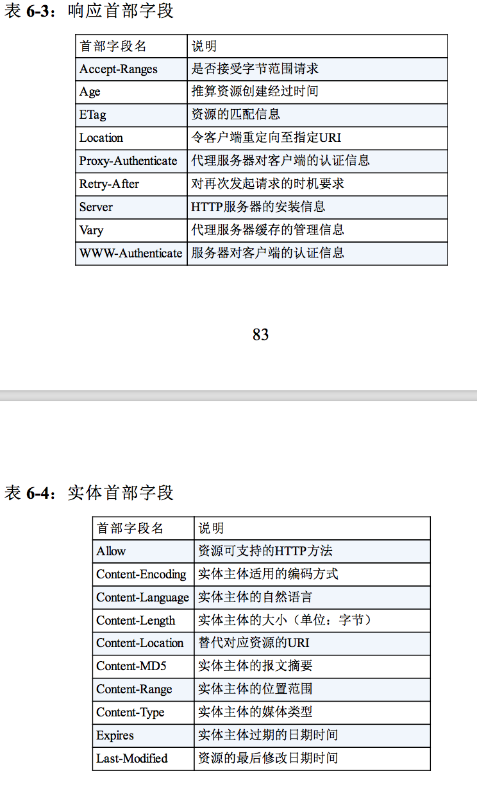

## HTTP首部

HTTP协议的请求和响应报文必定包含HTTP首部，只是我们平时在使用Web的过程中感受不到它。

#### HTTP报文首部

HTTP协议的请求和响应报文必定包含HTTP首部。首部内容为客户端和服务器分别处理请求和响应提供所需要的信息。

**HTTP请求报文**

在请求中，HTTP报文由方法、URL、HTTP版本、HTTP首部字段等部分构成。

**HTTP响应报文**
在响应中，HTTP报文由HTTP版本、状态码、HTTP首部字段3部分构成。

### HTTP首部字段
#### HTTP首部字段传递重要信息
HTTP首部字段是构成HTTP报文的要素之一。在客户端与服务器之间以HTTP协议进行通信的过程中，无论是请求还是响应都会使用首部字段。它能起到传递额外重要信息的作用。

使用首部字段是为了给浏览器和服务器提供报文主体大小、所使用的语言、认证信息等内容。

#### HTTP首部字段结构
HTTP首部字段是由首部字段和字段值构成的，中间用冒号‘:’分割`首部字段名：字段值`

字段值对应单个HTTP首部字段可以有多个值`Keep-Alive：timeout=15，max=100`

#### 4种HTTP首部字段类型
HTTP首部字段根据实际用途被分为以下4种类型

**通用首部字段**
请求报文和响应报文两方都会使用的首部

**请求首部字段**
从客户端向服务器端发送请求报文时使用的首部。补充了请求的附加内容、客户端信息、响应内容相关优先级等信息

**响应首部字段**
从服务器端向客户端返回响应报文时使用的首部。

**实体首部字段**
针对请求报文和响应报文的实体部分使用的首部。

#### HTTP/1.1首部字段一览

#### 非HTTP/1.1首部字段
在HTTP协议通信交互中使用到的首部，不限于RFC中定义的47种首部字段。还有Cookie、Set-Cookie和Content-Disposition等

#### End-to-end首部和Hop-by-hop首部
HTTP首部字段将定义缓存代理和非缓存代理的行为。

**端到端首部End-to-end Header**
分在此类别中的首部会转发给请求/响应对应的最终接收目标，且必须保存在由缓存生成的响应中，另外规定它必须被转发。

**逐跳首部Hop-by-hop Header**
分在此类别中的首部只对单次转发有效，会因通过缓存或代理而不再转发。

列举HTTP中的逐跳首部字段。除这8个首部字段之外，其他所有字段都属于端对端首部
- Connection
- Keep-Alive
- Proxy-Authenticate
- Proxy-Authorization
- Trailer
- TE
- Transfer-Encoding
- Upgrade

### HTTP/1.1通用首部字段
通用首部字段是指，请求报文和响应报文双方都会使用的首部。

#### Cache-Control
通过制定首部字段Cache-Control指令，就能操作缓存的工作机制。

指令的参数是可选的，多个指令之间通过‘,’分隔。首部字段Cache-Control的指令可用于请求及响应时。
`Cache-Control:private, max-age=0, no-cache`

**Cache-Control指令一览**

可用的指令按请求和响应分类如下

##### 表示是否能缓存的指令
**public指令**`Cache-control: public`

当指令使用public指令时，则明确表示其他用户也可利用缓存

**private指令**`Cache-control: private`

当指定prive指令后，响应只以特定的用户作为对象，这与public指令的行为相反。

缓存服务器会对该特定用户提供资源缓存的服务，对于其他用户发送过来的请求，代理服务器则不会反悔缓存。

**no-cache指令**`Cache-control: no-cache`

使用no-cache指令的目的是为了防止从缓存中返回过期的资源。

客户端发送的请求中如果包含no-cache指令，则表示客户端将不会接受缓存过的响应。于是，‘中间’的缓存服务器必须把客户端请求转发给源服务器。

如果服务器返回的响应中包含no-cache指令，那么服务器不能对资源进行缓存。源服务器以后也将不再对缓存服务器请求中提出的资源有效性进行确认，且禁止对响应资源进行缓存操作

`Cache-Control：no-cache=Location`

##### 控制可执行缓存的对象的指令

**no-store指令**`Cache-Control：no-store`

使用no-store指令时，暗示请求或响应中包含机密信息

> 从字面意思上很容易把no-cache误解成为不缓存，但事实上no-cache代表不缓存过期的资源，缓存会向源服务器进行有效确认后处理资源。no-store才是真正地不进行缓存。

##### 指定缓存期限和认证的指令
**s-maxage指令**`Cache-Control：s-maxage=604800(单位：秒)`

s-maxage指令的功能和max-age指令的相同，不同点s-maxage指令只适用于多位用户适用的公共缓存服务器。

当使用s-maxage指令后，则直接忽略对Expries首部字段及max-age指令的处理。

**max-age指令**`Cache-Control：max-age=604800（单位：秒）`

当客户端发送的请求中包含max-age指令时，如果判定缓存资源的缓存时间数值对指定时间的数值更小，那么客户端就接收缓存的资源。

当服务器返回的响应中包含max-age指令时，缓存服务器将不对资源的有效性再作确认，而max-age数值代表资源保存为缓存的最长时间。

**min-fresh指令**`Cache-Control:min-fresh=60(单位：秒)`

min-fresh指令要求缓存服务器返回至少还未过指定时间的缓存资源

**max-stale指令**`Cache-Control：max-stale=3600（单位：秒）`

使用max-stale可指示缓存资源，即时过期也按照常接收

**only-if-cached指令**`Cache-Control：only-if-cached`
使用only-if-cached指令表示客户端仅在缓存服务器本地目标资源的情况下才会要求其返还

**must-revalidate指令**`Cache-Control：must-revalidate`
使用must-revalidate指令，代理会向源服务器再次验证将返回的响应缓存目前是否仍然有效

**proxy-revalidate指令**`Cache-Control：proxy-revalidate`
proxy-revalidate指令要求所有的缓存服务器在接收到客户端带有该指令的请求返回响应之前，必须再次验证缓存的有效性。

**no-transform指令**`Cache-Control:no-transform`
使用no-transform指令规定无论是在请求还是响应中，缓存都不能改变实体主体的媒体类型

这样做可防止缓存或代理压缩图片等类似操作

#### Connection
Connection首部字段具备如下两个作用
- 1.控制不再转发给代理的首部字段
- 2.管理持久连接

#### Date
首部字段Date表明创建HTTP报文的日期和时间

### 4.请求首部字段
请求首部字段是从客户端往服务器端发送请求报文中使用的字段，用于补充请求的附加信息、客户端信息、对响应内容相关的优先级等内容。

### 5.响应首部字段
响应首部字段是由服务器向客户端返回的响应报文中所使用的字段，用于补充响应的附加信息、服务器信息，以及对客户端的附加要求等信息

### 6.实体首部字段
实体首部字段是包含在请求报文和响应报文中的实体所使用的首部，用于补充内容的更新时间等于实体相关的信息。

